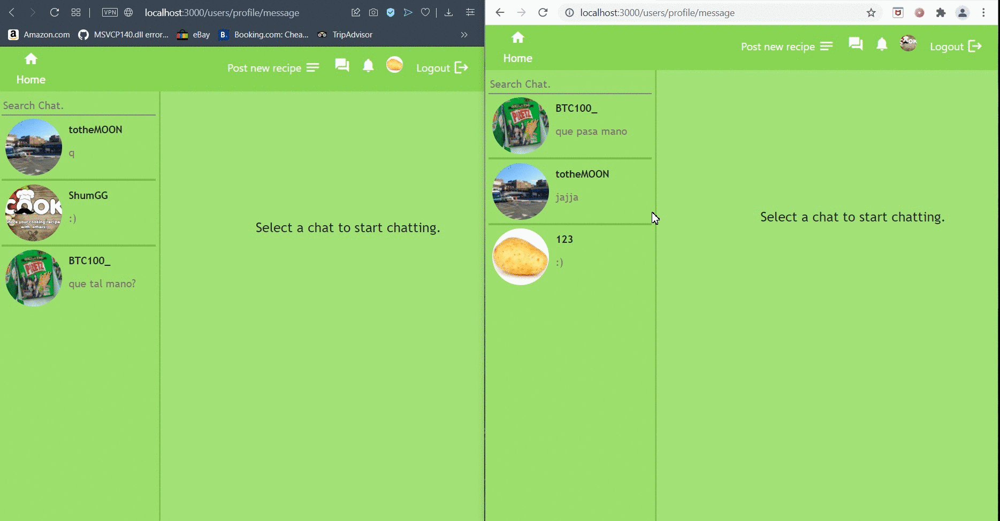

# :fork_and_knife: COOK :fork_and_knife:

A small webpage where users can share their cooking recipes with others.

 

# 

Fifth personal project. Built it using MERN and websockets :electric_plug:.

#

## Index:

### 

 

 
###

## Login:

 

###

## Register:

 

###

## Post:

While the user is writing the recipe, a preview is displayed below.

 

###

## Notifications:

The user will recive notifications (offline - online) , these are:

 <h5> Like post. </h5>
 <h5> Comment on post. </h5>
 <h5> Like his comment on a post. </h5>
 <h5> A new follower. </h5>
 

 

###

## Chat and Mini chat:

Users will be able to talk with others, using the main chat or the mini chat while browsing, if the user is offline and recive a message once hes logged he will get a notification.

 

 

###

## Comment on posts: 

Users can let a comment on their favorites posts.

 

###

## Extras:

<h5> Follow - Unfollow. </h5>
<h5> Option to see the posts of your followers or the people you are following.</h5>
